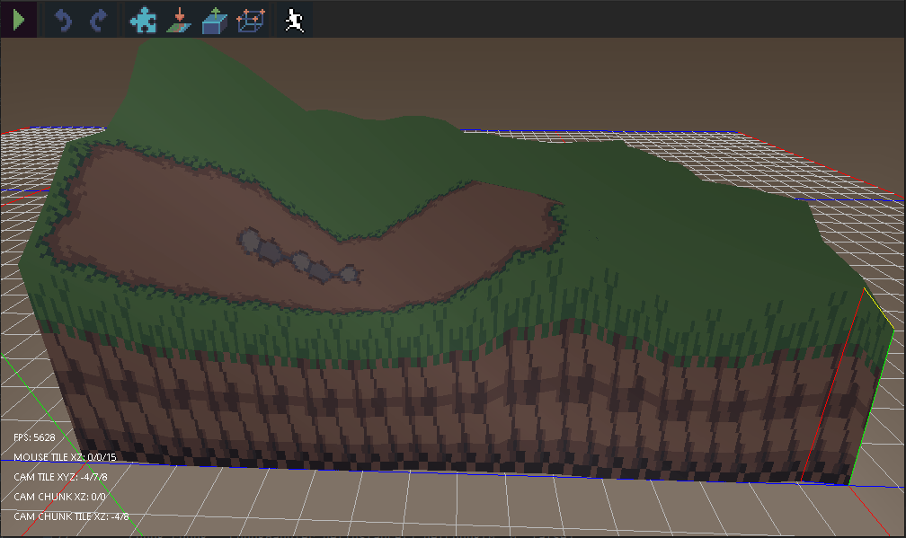

# Java Auto Tile Implementation

This is a java Bit Masking auto-tile implementation in pure java based on a [tutorial] by [Sonny Bone].

This library can be used in both a 2D and 3D context. Just import this project into your game and then implement the getters and setters for your map implementation. The library will take care of the rest in terms of selecting the correct tile to place on your map.

This project uses [Lombok] getters and setters to make our life easier.
You may need to install a plugin in your IDE to use it properly.

## What is BitMasking Auto Tiling?

"Tile bitmasking is a method for automatically selecting the appropriate sprite from a defined tileset. This allows you to place a generic placeholder tile everywhere you want a particular type of terrain to appear instead of hand placing a potentially enormous selection of various tiles." - [Sonny Bone]




## Major TODOS:
- Fix the HTML demo
- Implement brush sizes
- Finish the tile-editor

## Clone to test the demo!
The demo was created with [libGDX]. 

Demo Controls:
- Left-Click to drawl a tile
- Right-Click to remove a tile

## Usage

```xml
<repositories>
    <repository>
        <id>jitpack.io</id>
        <url>https://jitpack.io</url>
    </repository>
</repositories>
```

```xml
<dependencies>
    <dependency>
        <groupId>com.github.unenergizer.javaautotile</groupId>
        <artifactId>autotile</artifactId>
        <version>${version}</version>
    </dependency>
</dependencies>
```

## License

This project is licenced under the [Apache 2.0] license.

[libGDX]: <https://github.com/libgdx/libgdx>
[tutorial]: <https://gamedevelopment.tutsplus.com/tutorials/how-to-use-tile-bitmasking-to-auto-tile-your-level-layouts--cms-25673>
[Sonny Bone]: <https://twitter.com/Phantom_Green>
[Lombok]: <https://projectlombok.org/>
[Apache 2.0]: <https://www.apache.org/licenses/LICENSE-2.0>
